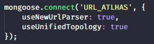
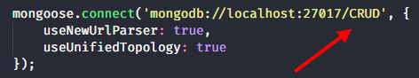
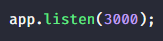

# NodeJS CRUD

A simple project based on Rocketseat Starter NodeJS.

<h3>Getting Started</h3>

These instructions will get you a copy of the project up and running on your local machine for development purposes.

<h3>Prerequisites</h3>

<h4>NodeJS</h4>

You need to install NodeJS on your computer before you can use "**NodeJS CRUD**". You can install NodeJS by following <a href="https://nodejs.org/en/download/package-manager/">these instructions</a>.

Once you have completed the installation process, try typing **```npm -v```** into your command line. You should get a response with the version of NodeJS.

<h4>MongoDB local or Atlas</h4>

You need to install and configure a MongoDB on your computer or have a connection string for a database in Atlas cloud before you can use the "**NodeJS CRUD**".

You can install MongoDB by following these instructions (<a href="https://treehouse.github.io/installation-guides/mac/mongo-mac.html">Mac</a> and <a href="https://treehouse.github.io/installation-guides/windows/mongo-windows.html">Windows</a>).

If you have a string url from a "**Athas BD**", just change de string connection (<i>"serve.js"</i>):



<h4>REST API Client</h4>

Finally, you will need a rest api client to test "**NodeJS CRUD**". Examples:

<ul>
  <li><a href="https://insomnia.rest/">Insomnia</a></li>
  <li><a href="https://www.getpostman.com/">Postman</a></li>
  <li><a href="https://install.advancedrestclient.com/install">Advanced REST Client</a></li>
</ul>

<h3>Deploy</h3>

After clone repository, run **```npm i```** to install dependencies and run **```nodemon```** to start de aplication.

<i>If you don't have nodemon installed, run **```npm install nodemon -g```**.</i>

Now you can use your REST API Client to test "**NodeJS CRUD**".

<h3>Notes</h3>

If you want, you can change "**CRUD**" (database) to other name you liked (<i>"serve.js"</i>).



You can change port "**3030**" to another port you want (<i>"serve.js"</i>):



You also can change de schema to the way you want "**Person.js**".

<h3>Built With</h3>

<ul>
  <li>NodeJS</li>
  <li>MongoDB</li>
</ul>

<h3>Authors</h3>

<ul>
  <li>Matheus Leandro</li>
</ul>

<h3>License</h3>

This project is licensed under the MIT License - see the <a href="https://github.com/matheusleandroo/rocketseat-starter-es6/blob/master/LICENSE">LICENSE.md</a> file for details
